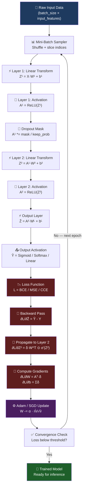
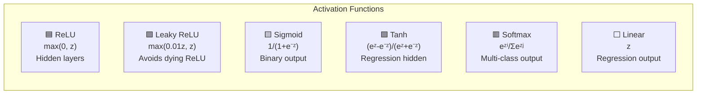

# Synapse.cpp 🧠

> **A Multi-Layer Perceptron from scratch in pure C++ — no libraries, no magic, just math and memory management.**

[](https://isocpp.org/)
[](LICENSE)
[]()
[]()

---

## What Is This?

**Synapse.cpp** is a hand-rolled implementation of a Multi-Layer Perceptron (MLP) written in raw C++17. Every single operation — matrix multiplication, backpropagation, the Adam optimizer — is implemented from first principles. The only things used are `<cmath>` for `exp`, `log`, `sqrt`, and raw heap-allocated arrays for storage.

This is an **educational reference implementation** designed to be read and understood, not just used.

---

## Architecture Overview


---

## How a Neural Network Actually Works — From the Ground Up

### Step 1 — The Neuron

A single neuron receives inputs, multiplies each by a **weight**, sums them up, adds a **bias**, and passes the result through an **activation function**:

```
z = w₁x₁ + w₂x₂ + ... + wₙxₙ + b    (linear combination)
a = σ(z)                               (activation)
```

In matrix form for a whole layer processing a whole batch:

```
Z = X · W + b     (batch_size × units)
A = σ(Z)
```

### Step 2 — The Network (Forward Pass)

An MLP chains multiple layers. Each layer's output `A` becomes the next layer's input `X`:

```
Layer 1:  Z¹ = X  · W¹ + b¹  →  A¹ = σ(Z¹)
Layer 2:  Z² = A¹ · W² + b²  →  A² = σ(Z²)
   ...
Output:   Ẑ  = Aᴸ⁻¹ · Wᴸ + bᴸ →  Ŷ = σ(Ẑ)
```

### Step 3 — The Loss Function

We measure how wrong the predictions are:

| Loss | Formula | Used For |
|------|---------|----------|
| **MSE** | `L = (1/2n) Σ (ŷ - y)²` | Regression |
| **Binary Cross-Entropy** | `L = -(1/n) Σ [y·log(p) + (1-y)·log(1-p)]` | Binary classification |
| **Categorical Cross-Entropy** | `L = -(1/n) Σ Σ yᵢⱼ·log(p̂ᵢⱼ)` | Multi-class classification |

### Step 4 — Backpropagation (The Heart of Learning)

This is where the magic happens. We compute how much each weight contributed to the error using the **chain rule** of calculus — propagating gradients **backward** through the network.

**Output layer gradient:**
```
∂L/∂Z^L = Ŷ - Y          (combined loss + activation gradient for BCE/CCE)
```

**Hidden layer gradient (chain rule):**
```
∂L/∂A^l   = ∂L/∂Z^(l+1) · (W^(l+1))ᵀ
∂L/∂Z^l   = ∂L/∂A^l  ⊙  σ'(Z^l)      (⊙ = element-wise)
∂L/∂W^l   = (A^(l-1))ᵀ · ∂L/∂Z^l
∂L/∂b^l   = Σ ∂L/∂Z^l   (sum over batch)
```

### Step 5 — Weight Update (Optimizer)

**SGD with Momentum:**
```
velocity = β·velocity - α·∇W
W        = W + velocity
```

**Adam (Adaptive Moment Estimation):**
```
m = β₁·m + (1-β₁)·∇W        (1st moment — mean)
v = β₂·v + (1-β₂)·∇W²       (2nd moment — variance)
m̂ = m/(1-β₁ᵗ)               (bias correction)
v̂ = v/(1-β₂ᵗ)
W = W - α · m̂/(√v̂ + ε)
```

---

## Full Data Flow — End to End



---

## Activation Functions



---

## Weight Initialization Strategies

| Method | Formula | Best For |
|--------|---------|----------|
| **Xavier Uniform** | `U[-√(6/(fᵢₙ+fₒᵤₜ)), +√(6/(fᵢₙ+fₒᵤₜ))]` | Sigmoid / Tanh |
| **He Normal** | `N(0, √(2/fᵢₙ))` | ReLU layers |
| **Random Uniform** | `U[-0.5, 0.5]` | Quick experiments |
| **Random Normal** | `N(0, 0.01)` | Small-scale nets |

---

## Project Structure

```
Synapse.cpp/
├── Matrix.hpp      ← Matrix class declaration (all operations)
├── Matrix.cpp      ← Matrix implementation (dot, broadcast, init...)
├── MLP.hpp         ← MLP class: layers, configs, enums
├── MLP.cpp         ← Full forward pass, backprop, Adam, SGD, training loop
├── main.cpp        ← 4 live demos: XOR, Circle, Sine, Blobs
└── README.md       ← You are here
```

---

## Building and Running

**Requirements:** Any C++17-compatible compiler (GCC, Clang, MSVC).

```bash
# Compile
g++ -O2 -std=c++17 main.cpp Matrix.cpp MLP.cpp -o synapse

# Run all 4 demos
./synapse

# Windows
g++ -O2 -std=c++17 main.cpp Matrix.cpp MLP.cpp -o synapse.exe
.\synapse.exe
```

---

## Demo Experiments

### Demo 1 — XOR Problem
The XOR function is not linearly separable (no single line can divide the classes). A two-layer MLP solves it perfectly.

| Input | Expected | Predicted |
|-------|----------|-----------|
| (0, 0) | 0 | ≈ 0.01 |
| (0, 1) | 1 | ≈ 0.99 |
| (1, 0) | 1 | ≈ 0.99 |
| (1, 1) | 0 | ≈ 0.02 |

- **Architecture:** `2 → 8 → 1`
- **Loss:** Binary Cross-Entropy
- **Optimizer:** Adam

### Demo 2 — Circle Dataset
Points inside radius 0.6 → class 1. Non-linear boundary requires multiple layers.
- **Architecture:** `2 → 16 → 8 → 1`
- **Expected accuracy:** ~98%

### Demo 3 — Sine Regression
Approximate `f(x) = sin(2πx) + noise` from 300 noisy samples.
- **Architecture:** `1 → 64 → 64 → 1` (Tanh hidden, Linear output)
- **Expected MSE:** `< 5×10⁻⁴`

### Demo 4 — 3-Class Gaussian Blobs
Three overlapping Gaussian clusters. Tests Softmax + Categorical Cross-Entropy.
- **Architecture:** `2 → 32 → 16 → 3`
- **Expected accuracy:** ~99%

---

## Feature Matrix

| Feature | Status |
|---------|--------|
| Arbitrary depth & width | ✅ |
| ReLU, Leaky-ReLU, Sigmoid, Tanh, Softmax | ✅ |
| Linear activation (regression) | ✅ |
| MSE loss | ✅ |
| Binary Cross-Entropy loss | ✅ |
| Categorical Cross-Entropy loss | ✅ |
| SGD with momentum | ✅ |
| Adam optimizer | ✅ |
| Xavier weight init | ✅ |
| He weight init | ✅ |
| Dropout regularisation | ✅ |
| Gradient clipping | ✅ |
| Mini-batch training | ✅ |
| Numerically stable softmax | ✅ |
| Bias-corrected Adam | ✅ |
| Training / eval mode | ✅ |
| Accuracy metric | ✅ |
| Loss history tracking | ✅ |
| Model summary printer | ✅ |
| Zero external dependencies | ✅ |

---

## Matrix Engine

The `Matrix` class at the heart of Synapse.cpp implements:

- **Storage:** flat `double*` array (row-major), allocated with `new[]`
- **Ownership:** RAII — destructor calls `delete[]`, copy constructor deep-copies
- **Move semantics:** `Matrix(Matrix&&)` transfers ownership without copying
- **Operations:** `+`, `-`, `*` (element-wise), `dot()` (matmul), `transpose()`, `broadcastAdd()`, `sum(axis)`, `mean(axis)`, `exp()`, `log()`, `clip()`, `argmax()`
- **Init:** Xavier uniform, He normal, random uniform, random normal (Box-Muller)

---

## Math Reference

### Backpropagation Derivation (MSE Loss)

```
L = (1/2n) ||Ŷ - Y||²

∂L/∂Ŷ  = (Ŷ - Y)/n                    ← output gradient

For layer l (going backwards):
∂L/∂Zˡ = ∂L/∂Aˡ ⊙ σ'(Zˡ)            ← activation gradient
∂L/∂Wˡ = (Aˡ⁻¹)ᵀ · ∂L/∂Zˡ           ← weight gradient
∂L/∂bˡ = Σᵢ ∂L/∂Zˡᵢ                  ← bias gradient (sum over batch)
∂L/∂Aˡ⁻¹ = ∂L/∂Zˡ · (Wˡ)ᵀ           ← propagate to previous layer
```

### Adam Update Rule

```
t ← t + 1
mᵥᵥ ← β₁·mᵥᵥ + (1-β₁)·∇W
vᵥᵥ ← β₂·vᵥᵥ + (1-β₂)·∇W²
m̂   ← mᵥᵥ / (1 - β₁ᵗ)
v̂   ← vᵥᵥ / (1 - β₂ᵗ)
W   ← W - α · m̂ / (√v̂ + ε)

Defaults: β₁=0.9, β₂=0.999, ε=1e-8
```

---

## License

MIT — see [LICENSE](LICENSE).

---

*Built entirely from scratch. No PyTorch. No TensorFlow. No Eigen. Just C++.*
